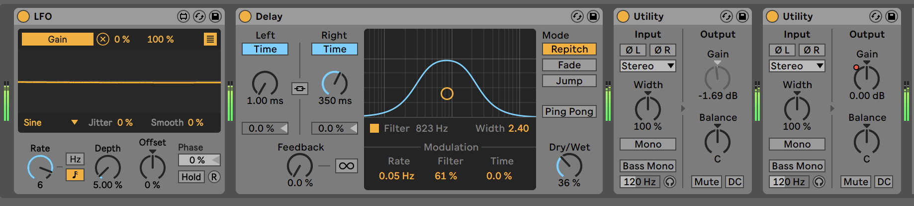
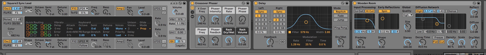
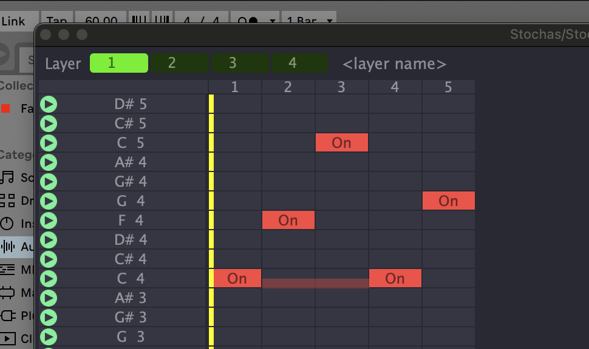
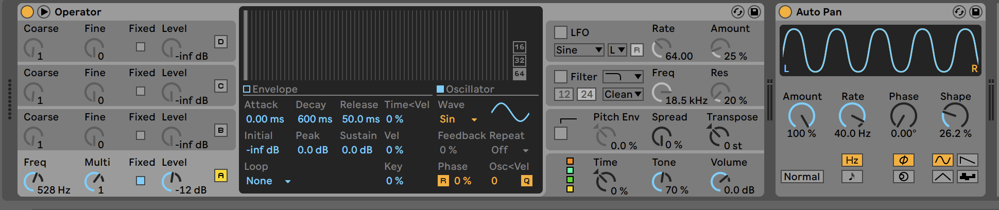

I've been using various meditation "tapes" off and on for quite a long time. Recently, I got back into them via the Gateway tapes from the Monroe Institute, and then discovered Tom Campbell's material. All of this re-ignited my interest in exploring binaural beats[^1] as an aid to meditation. 

_(An aside: I fully acknowledge that these are "crutches," and being fixated on various tones and so-called focus levels can be counterproductive. But for me—and for many others—these tools can still be beneficial.)_

Not that there was a *gap* in the market for binaural beat meditation tracks, but I felt like taking a detour down the learning and exploration rabbit hole, reacquainting myself with Ableton Live and the process of creating tracks like these.

**What I wanted:** A pleasant, organic-sounding "noise" that pulses and moves throughout the stereo field without being too distracting.

**How I accomplished it:** I used Audacity to generate two hours of brownian noise[^2], so I would have plenty of material when building tracks with a noise base—whether for 15, 30, or even 120 minutes. I then used a built-in LFO set to a *very* slow rate to modulate both a delay filter and the gain, creating a subtle, evolving pulse.

**What I wanted:** A cool, analog synth-style intro tag reminiscent of the Gateway Experience tapes.

**How I accomplished it:** At the start of the early Gateway tapes from the Monroe Institute, there was a really *cool* analog synth intro that sounded like a random sample/hold arrangement. I chose a more tonal arpeggiation for my intro tag.

You can hear this at the start of every track on this album. I used the Stochas plugin to run the arpeggiation:

The next part was having a continually changing binaural tone anchored to the carrier. To accomplish this, I once again used an LFO to take the 128 Hz carrier and 132 Hz binaural tone and vary it between 131 and 134 Hz at a very slow rate. In addition to the 128 Hz carrier, I added an isochronic tone[^3] pulsed at 40 Hz. Depending on the track, this is one of several solfeggio frequencies:

I used Auto-Pan with a sine wave at 40 Hz to let the pulses sound without clipping.

### Solfeggio Frequency Table

| Frequency (Hz) | Name/Use                                  |
| -------------- | ----------------------------------------- |
| 396            | Liberating Guilt and Fear                 |
| 417            | Undoing Situations and Facilitating Change|
| 528            | Transformation and Miracles (DNA Repair)  |
| 852            | Returning to Spiritual Order              |

I created one 15 and 30 minute track for each of the frequencies in the table above. The 15 and 30 minute tracks are identical apart from the runtime.  I personally like to have the "meditation ending" sounds and use them as timers if I'm doing things like sauna, or have a limited time for meditation (like lunch break, etc).

https://templeofexla.bandcamp.com/album/phase-temple-440

This is pay what you want, and by all means, put $0 if you want, or more, it's up to you.  They were created as a personal experiment, so I have no expectations of monetary gain on this project!

#### Additional Notes & References

- The Monroe Institute developed the Gateway Experience series, a foundational source of binaural beat audio for altered states of consciousness.[^4]
- Tom Campbell (author of *My Big TOE*) often references the use of binaural beats as part of consciousness exploration.[^5]
- Isochronic tones differ from binaural beats in that they use single tones pulsed on and off, whereas binaural beats require headphones and use two close frequencies to create a beat in the brain.[^1][^3]

---

[^1]: https://en.wikipedia.org/wiki/Binaural_beats  
[^2]: https://en.wikipedia.org/wiki/Colors_of_noise#Brownian_noise  
[^3]: https://en.wikipedia.org/wiki/Isochronic_tones  
[^4]: https://www.monroeinstitute.org/  
[^5]: https://www.mbtevents.com/
