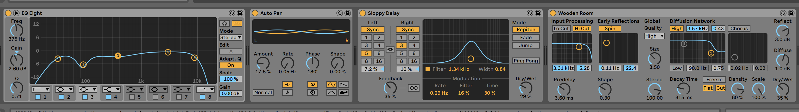
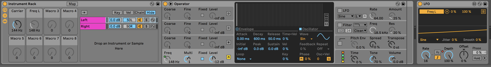

TL;DR - [Here is the audio track, PWYW @ Bandcamp](https://templeofexla.bandcamp.com/album/echoes-at-the-threshold-tom-s-park-meditations-vol-01)

## Introduction

This project brings together technology, creativity, and consciousness exploration—combining AI narration, sound design, and a carefully crafted script to create a 30-minute guided meditation. Our journey is inspired by Tom Campbell’s “Tom’s Park,” a multi-sensory imagination training ground for growing intuition and inner clarity[^3].

**Technical process:**  
- The meditation script was developed using ChatGPT, with personal edits and direction.
- Tom’s voice was generated using AI Guy, captured via the AudioHijack app for high-quality audio recording.
- The narration audio was slowed using `ffmpeg` to achieve a gentle, immersive pace. For example, to slow audio to 85% speed, you can use:
  ```
  ffmpeg -i original.wav -filter:a "atempo=0.85" slowed.wav
  ```
- Final audio was processed and mastered in Ableton Live.
    - 

- **Natural background ambiance:** The primary environmental sound in this meditation is a field recording of “Birds and toucans in the Amazonian Rainforest at dawn, close to a small river, in the area of Tauary (Amazona, Brasil)” by felix.blume[^7].
- Background sound design includes a 144 Hz binaural carrier, a 528 Hz isochronic tone at 40 Hz, and a subtle LFO that moves the binaural frequency between 3.5–4.5 Hz. This combination supports deep relaxation and a receptive state for inner work.
    - 

## About Tom’s Park

Tom’s Park is a unique guided meditation framework created by physicist and consciousness researcher Thomas Campbell, author of “My Big TOE” and *Tom’s Park: A Virtual Imaginality Game*[^3].  
Unlike traditional meditations, Tom’s Park uses imagination and “play” to help bypass the intellectual mind, making it especially accessible for analytical or left-brained people. The Park is a safe, co-created inner space for healing, intuition, and consciousness exploration—each visit is shaped by your own intention and curiosity[^1][^2][^3].

*This particular journey leads you to the Lake in Tom’s Park, but the same approach can be used to explore any area or intent within the Park.*

## On Heart Coherence

We open this meditation with a brief heart coherence exercise, inspired by the research of HeartMath and the embodied work of Stephen Harrod Buhner[^4][^5]. Heart coherence helps shift you into a receptive, connected state—grounding awareness in both the heart and body, and supporting the intuitive dimension of the Park journey.

## Oak Tree as Liminal Passage

As you enter Tom’s Park, you pass through a great oak tree—an ancient symbol in many traditions for crossing thresholds, connecting worlds, and anchoring spiritual journeys. The oak as “doorway” or liminal passage draws on its role as sacred tree, axis mundi, and place of initiation in Celtic, Norse, and mythic systems[^6]. For many, this motif adds depth, safety, and archetypal resonance to the transition into inner space.

## Guided Meditation Script

> **Tip:** For best results, use headphones. Find a quiet, comfortable place to sit or lie down.  
>  
> There’s no right or wrong way to do this meditation. Be playful, curious, and open to whatever arises.

---

### Welcome and Heart Coherence Breathing

Welcome.  
Find a comfortable position—lying down or seated upright, spine long, hands relaxed.  
Let your eyes drift closed.

Bring your attention to your breath.  
Gently inhale through your nose, and exhale slowly through your mouth.  
Feel your body begin to soften, your mind become still.

Now, bring your awareness to the center of your chest, your heart.  
Imagine breathing directly in and out through your heart space.

Inhale gently for a count of four…  
Pause…  
Exhale softly for a count of four…  
Pause…  
(Repeat for several rounds.)

As you breathe, imagine a feeling of gratitude or love filling your chest—like a warm, glowing light.  
Let that feeling grow brighter with each breath.

If your mind wanders, gently return to your breath and your heart.

---

### Intention Setting

Now, softly, bring to mind your intention for this journey.  
What do you hope to discover, heal, or create in this experience?  
Let the feeling of this intention settle into your heart.

Remind yourself that Tom’s Park is a place for playful exploration, personal growth, and intuition.  
There’s no way to do this wrong—be light, be curious, and let your experience unfold naturally.

---

### Wildflower Path to the Oak Tree

Begin to imagine yourself standing at the start of a beautiful path.  
The air is gentle and fresh.  
Before you, a trail winds forward, flanked by wildflowers of every color, moving in a soft breeze.

Walk slowly, noticing the feel of the ground, the warmth of sunlight, the coolness in the shade.

Hear the hum of bees, the distant song of a bird, the gentle rustle of leaves.

With every step, you feel more relaxed and present.

Soon, you see a magnificent oak tree ahead—its branches wide and welcoming.

As you approach, feel the gentle energy radiating from the tree.  
Place your hand on its bark—solid, textured, alive.

Circle the tree until you find a doorway, arched and inviting.

When you’re ready, step through the doorway.

---

### Arrival in Tom’s Park—Passing the Grill, Going to the Beach

As you step through the oak’s doorway, you find yourself standing right beside Uncle Tom’s Grill.

Take a moment here. Notice the easy warmth and inviting energy—a place of laughter, comfort, and friendly faces. Maybe you catch the aroma of something delicious or hear a gentle greeting.

When you’re ready, begin to walk down the path that leads to the beach.

As you follow the path, the sound of waves grows stronger. Soon, the space opens and you find yourself at the edge of a beautiful beach—soft sand, gentle waves, and a wide, open sky. You feel safe and welcome.

---

### Open Exploration at the Beach

Take a moment to pause here at the water’s edge.

Let yourself relax and take in the scene—sun, sand, water, the soothing rhythm of the waves.

There’s no right or wrong way to explore Tom’s Park. Let yourself play, wander, and notice anything that draws your attention. If something unexpected appears or happens, welcome it as a message or gift for your growth.

If you meet a helper or guide, allow yourself to receive whatever message or support is offered. Everything here is safe and for your benefit.

Stay here for as long as you wish, trusting your own curiosity and the gentle guidance of the Park.

---

### Guided Return from the Beach

When you’re ready to return, take a slow, deep breath.

Gently leave the beach and walk back along the path toward Uncle Tom’s Grill.

Notice any feelings of gratitude or insight as you pass.

Continue to the oak tree, its doorway waiting for you.

Pause for a moment, then step through the doorway, returning to your body and the present moment.

Feel the surface beneath you, the air around you, and the natural rhythm of your breath.

Begin to move your fingers and toes. When you’re ready, open your eyes—refreshed and awake, bringing any insight or calm with you.

---

### Integration & Repetition

Each visit to Tom’s Park helps build your intuitive skill and sense of connection. You can return as often as you wish—every experience is valid, and every journey is unique.

Notice any new insights or feelings that arise as you return to your day. Tom’s Park is here to support your growth and well-being, in meditation and in life.

Feel free to reflect or journal after your visit, or simply rest quietly, letting the gifts of your journey settle in.

---

## Practice Tips & References

> **A few tips for getting the most out of Tom’s Park:**
>
> - Use all your senses—imagine not just what you see, but what you hear, smell, touch, and taste.
> - There’s no right or wrong way. Playfulness, curiosity, and openness are your best guides.
> - Each session is different. Repetition builds skill and deeper connection.
> - Set a clear intention for each visit, but remain open to surprise.
> - Bring back what you learn—apply any insights to your everyday life.

For more, see Tom Campbell’s *Tom’s Park: A Virtual Imaginality Game*[^3], Nazarii’s [forum post](https://community.consciousnesshub.org/c/tom-s-park/help-needed#comment_wrapper_73440547)[^2], and the full [Practice Tips and Guidelines](/path/to/practice-tips) document. Much of the background and philosophy is also discussed by Tom in his [YouTube interview](https://www.youtube.com/watch?v=-danslgCyjk)[^1].

---

*Created using a combination of human intent and AI support. If you have feedback, or wish to share your experiences, please comment below or reach out via the contact page.*

---

[^1]: Tom Campbell, “Tom's Park: A Virtual Imaginality Game – Discussion & Q&A,” YouTube, https://www.youtube.com/watch?v=-danslgCyjk  
[^2]: Nazarii, "What to Do After Listening to All the Audio in Tom’s Park," ConsciousnessHub forum post, https://community.consciousnesshub.org/c/tom-s-park/help-needed#comment_wrapper_73440547  
[^3]: Tom Campbell, *Tom’s Park: A Virtual Imaginality Game* (2022), https://www.mybigtoe.com/store/toms-park/  
[^4]: HeartMath Institute, “What is Heart Coherence?” https://www.heartmath.org/resources/heart-coherence/  
[^5]: Stephen Harrod Buhner, *The Secret Teachings of Plants: The Intelligence of the Heart in the Direct Perception of Nature* (2004).  
[^6]: See “The Sacred Oak” (Druidic & mythic symbolism), https://www.learnreligions.com/the-sacred-oak-tree-2562061; Jung, *Man and His Symbols* (1964); and general archetypal literature on trees as liminal passages.  
[^7]: Felix Blume, “Birds and toucans in the Amazonian Rainforest at dawn, close to a small river, in the area of Tauary (Amazona, Brasil),” Freesound.org, https://freesound.org/people/felix.blume/sounds/408048/

