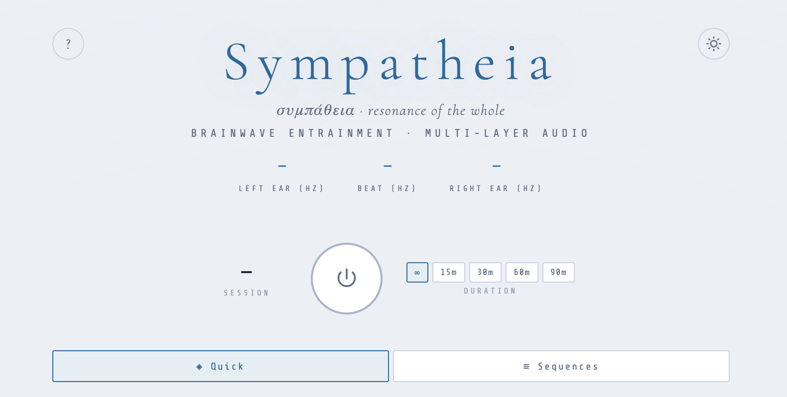
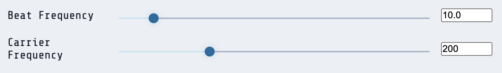
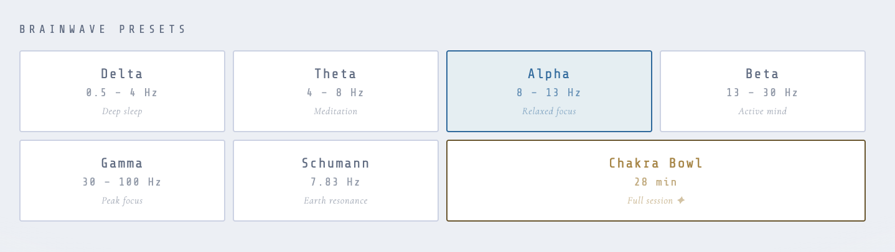
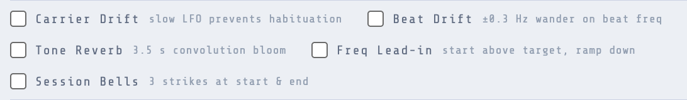

My first encounter with binaural beats came in the early 1990s, while in high school, through CoolEdit — a Windows audio editor by Syntrillium Software (released ~1992, later acquired by Adobe in 2003 to become Audition) that had a purpose-built binaural plugin alongside surprisingly capable sequencing features. I was just starting to explore natural, meditative altered states of consciousness at the time, and CoolEdit made it genuinely easy to experiment: dial in a frequency, set a session length, put on headphones.

Getting back into it more recently sent me down two different paths — the Monroe Institute's Gateway Experience materials on one side, and rebuilding sessions in a DAW like Ableton on the other. The DAW approach works, but it's labor-intensive to set up and inflexible once built. That tension of wanting the depth of a proper tool without the overhead is part of what pushed me to build something new. The idea that you could use audio to nudge your brain toward specific states — theta for deep meditation, alpha for relaxed focus, delta for restorative sleep — seemed as plausible now as it did then, and I wanted a better way to explore it.

Nothing adequate existed to fill the gap. The Monroe Institute's Hemi-Sync® recordings are the most credible commercial product in this space — their research goes back to the 1970s and has been referenced in serious scientific literature[^1] — but they're opaque (you can't see what frequencies they're using), expensive, and fixed. That said, they're still incredibly good, and having Bob Monroe lead you on a guided meditation is a genuine treat. 

Every other app or site I found aimed at a different market: streamed playlists with AI-generated "focus music," glossy wellness branding, tracks that sounded more like a dance club than a meditation room. Nothing that let you actually design a morphing session. Several sites were bare-bones and usable - but only with static frequencies, no dynamic beat and carrier movement over time.

Sympatheia — συμπάθεια, the Stoic and Neoplatonic concept of cosmic interconnection, everything in the universe vibrating in relation to everything else — is what I built instead. It runs entirely in the browser using the Web Audio API. No installs, no accounts, no server (apart from the web-server!). Open the page, put on headphones, press play. Everything is configurable in real time: beat frequency, carrier tone, layer volumes, session duration, the full arc of a programmed sequence. It's a sound designer's tool for a personal meditation practice, not a consumer product with a monthly subscription.

This is Part 1 of a six-part series. We'll start with the fundamentals: what binaural beats are, what the research actually says about them, and how to get a session running.

---

## What are binaural beats?

Binaural beats aren't actually a sound. They're something your brain constructs from sound.

When your left ear hears a tone at 200 Hz and your right ear hears a tone at 210 Hz simultaneously, your brain resolves that 10 Hz difference into a phantom pulse - a beat that has no physical existence. It's generated inside your auditory system, by a structure called the superior olivary nucleus that constantly computes the difference between signals arriving from each ear.[^2]

The practical consequence: **binaural beats require headphones**. Both ears need isolated signals. Play a binaural file over speakers and the tones mix in the air before they reach you — the difference signal collapses and you're left with two slightly mistuned tones and nothing else. Earbuds work fine. Any setup where left and right channels reach each ear separately is all you need.

The theoretical basis for why this matters: the brain tends to synchronize its electrical activity with perceived rhythms — a process called brainwave entrainment, or the frequency-following response. A stable 10 Hz pulse nudges it toward the alpha state: relaxed, open, lightly diffuse. 6 Hz theta sits at the hypnagogic edge between waking and sleep, that generative in-between territory where a lot of interesting things happen. Lower into delta and you're in deep rest and recovery. 

**Does it work?**

Probably, for some people, some of the time. It works for me consistently — but I've come to think it requires active participation rather than passive reception. You have to meet the entrainment halfway, bring some intention to it. The good news is that there is nothing to buy, no worldview to adopt, just bring open minded skepticism and try it yourself.  Play to find out.

The research is genuinely inconsistent: a 2023 systematic review in PLOS One examined 14 controlled studies and found five supporting the entrainment hypothesis, eight contradicting it, one mixed.[^3] The variance gets attributed to individual differences in baseline brain activity, methodological inconsistency across studies, and the persistent problem that a subjective sense of shifted state doesn't always show up in EEG data.  To me, this is unsurprising.  

Subjective experiences that shift your state of consciousness are notoriously hard to measure in a lab. You can't EEG someone's sense of peace or their access to intuition; you mostly get traces of neural activity and hope they correlate with what the person reports. Add in the placebo effect, individual variation, and the fact that meditation itself works partly through expectation and attention, and you've got a genuinely murky research landscape. The gap between "I felt something shift" and "we detected a statistically significant change in alpha power" is where most of these findings live.

What does seem solid is the relaxation response itself — the effect of sustained, pleasant audio regardless of frequency. Whether the binaural mechanism adds something on top of that, or whether the main benefit is simply sitting still with good sound for twenty minutes, is genuinely unclear. I don't think it matters much either way. I treat Sympatheia as a structured audio environment that creates conditions for meditation, not a neurological guarantee — I'll reach for it when other approaches aren't landing.

---

## Sympatheia

The interface is a single vertical column: session timer and power button at the top, brainwave preset strip below that, then core controls, options row, layers mixer, and sequencer.

The large **power button** in the center starts and stops audio. When running, it glows. Audio fades in over 4 seconds so it doesn't startle you out of wherever you were; it fades out gracefully on stop.

You don't need to configure anything to get started. The default state runs the binaural channel at 10 Hz alpha with a 200 Hz carrier. Put on headphones and press play.

---

## Core controls

Three sliders sit below the preset strip.

**Beat Frequency** — the entrainment target in Hz. This is the difference frequency your brain will perceive. Drag the slider or click the numeric input to type a value directly. Range is 0.1 to 100 Hz.

**Carrier Frequency** — the base pitch of the oscillators. The left ear gets the carrier; the right ear gets the carrier plus the beat frequency. At 200 Hz the tone is low and neutral. Higher values are brighter. Sacred frequency traditions assign significance to specific carriers — 432 Hz and 528 Hz come up a lot — but for pure entrainment purposes it's mostly an aesthetic call. Range is 80 to 500 Hz via the slider; the numeric input accepts up to 2000 Hz. I like 128 Hz, it's a power of two (2^7), and sounds good.

Above the Quick / Sequences tab: **session duration** and a timer display. Set a duration if you want the audio to fade out automatically; leave it at ∞ for an open session.

---

## Brainwave presets

The preset strip gives you one-tap access to the standard targets:

- **Delta** (2 Hz) — Deep sleep, recovery
- **Theta** (6 Hz) — Deep meditation, hypnagogia
- **Alpha** (10 Hz) — Relaxed, unfocused awareness
- **Beta** (18 Hz) — Active thinking, concentration
- **Gamma** (40 Hz) — Peak cognition, integration
- **Schumann** (7.83 Hz) — Earth's Schumann resonance

The Schumann resonance — the electromagnetic frequency of the Earth's ionospheric cavity[^4] — shows up across a lot of meditative and esoteric traditions as a kind of ground frequency, a baseline. Whether there's a direct physiological link between it and brain activity isn't established science, but 7.83 Hz sits right at the theta-alpha boundary and is subjectively interesting territory whatever the mechanism turns out to be.

Chakra Bowl is a pre-built session rather than single-frequency presets — we'll get into those in Part 4, but a brief description: We move both carrier and beat frequency into different regions and layer additional sounds at each transition.

---

## Carrier waveform

Four waveform buttons sit below the controls.

**Sine** is the default and the right choice for most purposes. In my practice, I _only_ use sine waves for the binarual beats. A pure sine wave has no harmonics — it's a single frequency, nothing else. This keeps the binaural mechanism clean and avoids the kind of harmonic fatigue that accumulates over a long session.

**Triangle** adds warm odd harmonics at low amplitude. Slightly thicker than sine, rarely a problem.

**Square** and **Sawtooth** are harmonically dense and worth exploring, but they can wear on you over sessions longer than 30 minutes. Better suited to specific shorter practices than as a full-session tone. I never use these for binaural beats, but included them for any weirdos out there who like this sound.

---

## Options: Drift and Lead-in

Five checkboxes sit in the options row. For a first session, ignore all of them. For subsequent sessions, two are worth understanding, and these already add a lot over what most app-based alternatives give you:

**Carrier Drift** — a very slow LFO (0.007 Hz, one full cycle every ~2.5 minutes) modulates the carrier frequency by ±8 Hz. This keeps the brain from fully habituating to a fixed pitch over longer sessions. The frequency display updates live when drift is active. Worth enabling for sessions over 20 minutes.

**Beat Drift** — a separate, even slower LFO (one cycle every 5 minutes, ±0.3 Hz) applied only to the right oscillator. The perceived beat frequency itself wanders slightly — never more than 0.3 Hz in either direction. This trades metronomic precision for something that feels more organic and alive, modeled on the observation that binaural recordings with slight frequency variation tend to feel more natural than a locked beat.

**Freq Lead-in** — starts the session with the beat frequency set above the target, then ramps it down smoothly over a set duration. Default is 6 Hz above target, ramping over 3 minutes. The idea: giving the brain something to follow downward is more effective than asking it to lock onto a fixed frequency cold. Anecdotally it makes the opening minutes feel less abrupt. _Try it_. I believe this to be especially useful when getting used to binaural beats and meditative practices.  If you're already adept, you probably don't need this.  I use it more mid-day than early morning or evening.

**Tone Reverb** — applies to the sacred frequency tones, covered in Part 3. It's subtle, but gives a bit more perceived warmth and depth to the tones.

**Session Bells** - Rings a bell 3 times at the start and end of the session, just to let you know it's time to get up. You can pick the frequency, the default is 432 Hz.

---

## Your first session

Minimal setup for a first run:

1. Be in a comfortable sitting, or lying down position.
2. Open [sympatheia](/instruments/sympatheia.html). Put on headphones.
3. Click **Alpha** in the preset strip. Beat 10 Hz, carrier 200 Hz.
4. Set duration to **30m** if you want a defined endpoint; leave at ∞ otherwise.
5. Enable **Carrier Drift** if you want. Leave everything else default.
6. Press play.

The binaural tone is deliberately subtle — a low, gentle hum with a slow internal pulse. If you can hear a clear beating quality, that's the entrainment signal. If you can't consciously detect it, that's fine too; it doesn't need to be audibly obvious to be present.

In the first few minutes, don't try to assess whether anything is happening. Brainwave entrainment, where it works at all, takes time to establish — most studies that find positive results use exposure durations of 15 to 30 minutes before measuring. Sit with it. The goal of a first session is just to get a feel for what this kind of audio environment is like for you personally.

**Things worth noticing:**

- Whether the body settles, or doesn't
- Whether your thought stream changes character — slower, faster, more visual, more diffuse
- Whether the tone becomes more or less prominent as the session goes on
- Whether 10 Hz alpha actually suits you, or whether a different frequency feels more natural

That last one matters more than it might seem. People vary a lot in how they respond to different frequencies. Some drop easily into theta; others find it disorienting and do better staying at alpha or low beta. Sympatheia is configurable specifically so you can find what works for your particular nervous system rather than taking someone else's word for it.

FWIW, I use this for meditation, not for focus, and am nearly always aiming for Theta regions, Schumann and below.  I'm sitting or laying down (in shavasana) and actively participating in obtaining a meditative state (breathing, awareness, etc).

## What's next

Part 2 covers the background layers — noise, ocean, sub-bass — and why a pure sine tone alone is rarely enough for a session of any real length. Part 3 goes into sacred frequencies and tone design. If you want to jump ahead to programming full session arcs, that's Part 4.

[^1]: The Monroe Institute, "Hemi-Sync® Research," https://monroeinstitute.org/research/
[^2]: Oster, G. (1973). "Auditory Beats in the Brain." *Scientific American*, 229(4), 94–102.
[^3]: Ingendoh, R.M., Posny, E.S., & Heine, A. (2023). "Binaural beats to entrain the brain? A systematic review of the effects of binaural beat stimulation on brain oscillatory activity, and the implications for psychological research and intervention." *PLOS ONE*, 18(5), e0286023. https://doi.org/10.1371/journal.pone.0286023
[^4]: Schumann, W.O. (1952). "Über die strahlungslosen Eigenschwingungen einer leitenden Kugel, die von einer Luftschicht und einer Ionosphärenhülle umgeben ist." *Zeitschrift für Naturforschung A*, 7(2), 149–154.
