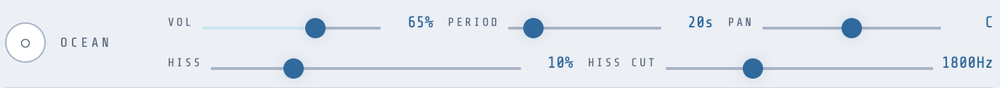
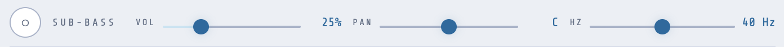
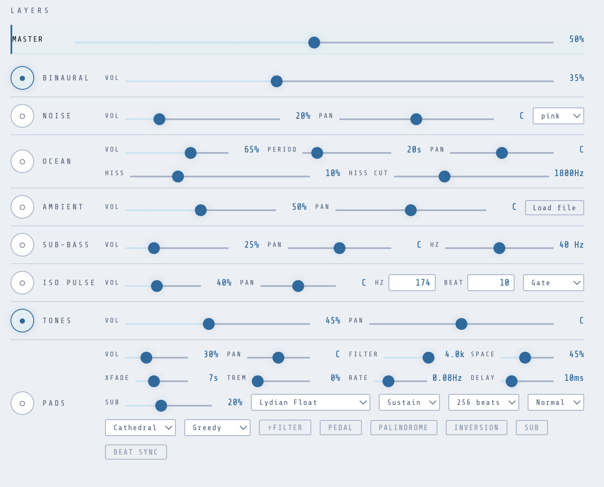

A lone sine wave at 200 Hz is technically correct as a binaural beat carrier. Put it on for twenty minutes and see how you feel. Most people find it fatiguing in a way that unstructured ambient sound isn't — partly because a single unwavering tone draws conscious attention to itself, and partly because the total absence of acoustic texture is its own kind of distraction. The mind has nothing to settle into.

The three background layers in Sympatheia — Noise, Ocean, and Sub-bass — each solve a different part of this problem. None of them are decorative. They're functional, and worth understanding.  It is rare that I run a session without at least the Ocean setting.

---

## Noise

Noise is the workhorse. It fills the acoustic gaps between the binaural carrier and any other layers, reduces the perceptual prominence of the entrainment tone[^1], and creates a steady neutral field that keeps the auditory system occupied without demanding attention.[^3]

Sympatheia provides three noise variants.

**White noise** is equal energy at every frequency. It's the hiss of an untuned radio, or rain on a window. Spectrally neutral, slightly bright, and clinically useful for masking — but over a long session it can read as harsh because high frequencies carry more perceived energy than low.

**Pink noise** — the default — rolls off at 3 dB per octave as frequency rises. Equal energy per octave rather than per Hz. This matches the 1/f characteristic of a lot of natural sounds and neural activity, which is why it's often described as sounding more natural than white. In practice: softer, warmer, easier to stay with. 

**Brown noise** (also called Brownian or red noise) rolls off at 6 dB per octave — a heavy bass emphasis, like the sound of a shower or a river heard from inside a building. Warm and enveloping. I find it grounding for sessions aimed at delta or deep theta. The low-frequency density sits at a register that white and pink don't reach, and it has a real physical weight to it. If I'm doing noise, this is what I do. I run low level Brownian noise overnight with a standalone device too if I want to mask other sounds.

The noise channel has vol and pan but no other controls — it's intentionally minimal. Set the type, blend it in at a level where you're aware of it but not focused on it, and leave it alone.

---

## Ocean

The ocean layer is procedurally generated, it's not a real ocean sample. Every session sounds slightly different because the "waves" are built in real time from layered noise sources and an asymmetric amplitude envelope. Getting this to sound good was one of the first things I worked on when building this app. I've got plenty of attempts in Ableton as well, building racks that essentially do what this webapp does, but with a whole lot less fiddling. Spoiler alert: It's still nowhere as good as sitting on the beach at the ocean, but for the purposes of an app like this, I prefer this type of _ocean noise_ to a looping audio file.

Technical details: two independent brown noise sources run through a low-pass filter, with one slightly offset in time via a slowly modulating delay. Their combined output is shaped by a wave envelope — an LFO running at the reciprocal of the **Wave Period** setting, fed through a asymmetric curve that gives each wave a brief sharp crest and a long gradual decline. A separate pink noise layer is gated open only at wave crests to simulate the high-frequency spray and hiss of breaking water. The same LFO also gently pans the entire signal side to side on each wave, so the source seems to move slightly — not dramatically, just enough to feel spatially alive.

What this produces is more convincing than a looped recording in one important way: no repeated loop points. A 20-second wave recording replays every 20 seconds, and the brain notices. A generated wave runs indefinitely without a seam.

The controls worth adjusting:

**Wave Period** — how many seconds between wave crests (15–60 s). Default is 20 s, which reads as a normal ocean rhythm. Longer periods are slower and more spacious; shorter periods are more active. A lot of my personal presets use 30 seconds.

**Hiss cut** — the highpass filter cutoff for the breaking-wave spray layer (800–4000 Hz). Higher values make the hiss brighter and more prominent; lower values let more of the surf texture through. This interacts with whatever else is in the mix: if you have noise running, you probably want the hiss cut higher so the ocean spray doesn't duplicate the noise channel in the same frequency range. For me it's an either / or.  If i have this on, noise is off.  I added this feature because I wanted a single source of background noise with more high-frequency control options.

**Hiss** — the gain of that same surf layer, independent of the overall ocean volume. Setting this to zero gives a smoother, more diffuse ocean; higher values add a crispness to each wave break. I generally keep it low — 10–15% — just enough to define the wave breaks without the spray becoming a focus.

Ocean is my primary background layer for most sessions. Something about the irregular rhythmic quality of waves — never perfectly metronomic, always subtly different — is particularly easy for the mind to release attention from. Unlike noise, which is static, the ocean gives the ear enough variation to track loosely and then let go. That's the texture you want for the background of a meditation session.

---

## Sub-bass

Sub-bass is the most specific and most optional of the three layers. It's a single sine oscillator running between 20 and 60 Hz — in the physical range you feel as much as hear.

The default is 40 Hz, and that's not arbitrary. The 40 Hz gamma band is the most extensively studied frequency in the auditory steady-state response (ASSR) literature. When a sound source is amplitude-modulated at 40 Hz, the auditory cortex reliably produces a neural oscillation at that same frequency — measurable by EEG. This is distinct from the binaural beat mechanism: it's a direct acoustic pathway, not a phantom beat. The 40 Hz cortical response is associated with attention, sensory integration, and cognitive binding, and it's been studied in contexts ranging from basic attention research to Alzheimer's disease.[^2]

A pure 40 Hz sine at low volume isn't amplitude-modulated in the same technical sense — it's the direct frequency rather than a modulated carrier. But the physical pulse is there, and at the right level it adds a felt quality to the session without being consciously audible as a pitched note. More of a presence than a sound.

The slider runs 20–60 Hz, so you're not limited to 40. Lower values (20–30 Hz) are in deep delta territory; higher values (50–60 Hz) move toward low gamma. If you're running a theta session at 6 Hz with the sub-bass at 40 Hz, you have two signals running simultaneously at very different frequencies — they don't interfere with each other, but they're targeting different things. Whether that's useful depends on what you're after.

At typical listening volumes, sub-bass below 30 Hz may not be audible on laptop speakers or earbuds. You'll feel it on a good pair of over-ear headphones or any system with real bass extension. This is one of those features that rewards good hardware.

---

## Layering in practice

None of these layers are enabled by default. You turn them on explicitly and adjust their levels to taste. A few approaches that work for me:

**Volume** — master output. The slider uses a squared taper (position² = gain), which tracks perceived loudness more naturally than linear amplitude. A position of 50% gives roughly half the perceived loudness, not half the signal level.

**Minimal:** Ocean at 50–60%, no noise, no sub-bass. Gives the session an ambient spatial environment without adding much harmonic or spectral content. Good for sessions where the tone work (pads, tones) is the main feature.

**Full environment:** Ocean at 40%, pink noise at 15–20%, sub-bass at 40 Hz at low volume. The noise fills the mid-frequency space; the ocean provides rhythmic grounding; the sub-bass adds physical weight. The binaural beat sits in the middle of all of this, audible but not exposed.

**Grounding (deep sleep or delta):** Brown noise at 30%, ocean at 35% with a long period (35–45 s), sub-bass at 25–30 Hz. Heavy, slow, low. Good for shavasana or sleep sessions where you're deliberately releasing the body.

**Focus (beta or gamma):** Pink or white noise at moderate volume, no ocean (too rhythmically distracting), no sub-bass. Or sub-bass at 40 Hz specifically for the gamma entrainment angle. The noise provides cognitive isolation; everything else is just the binaural signal.

One thing to watch: **stacking volume.** If you run ocean, noise, sub-bass, pads, and tones simultaneously at moderate individual volumes, the master level climbs quickly and the binaural carrier can get lost in the mix. The entrainment signal doesn't need to be loud — it just needs to be present and perceptible. If you can't detect the beating quality in the binaural channel, lower the background layers before raising the binaural volume.

## What's next

Part 3 is about sacred frequencies and tone design — what the solfeggio frequencies actually are, what the research does and doesn't say, and how to use Sympatheia's tone channel to trigger them manually or automatically during a session.

[^1]: Wegel, R.L., & Lane, C.E. (1924). "The auditory masking of one pure tone by another and its probable relation to the dynamics of the inner ear." *Physical Review*, 23(2), 266–285. The foundational masking research on how broadband noise reduces the salience of a tonal signal.
[^2]: Galambos, R., Makeig, S., & Talmachoff, P.J. (1981). "A 40-Hz auditory potential recorded from the human scalp." *PNAS*, 78(4), 2643–2647.
[^3]: "Parametric investigation of binaural beats and background noise." *Scientific Reports* (2025). https://www.nature.com/articles/s41598-025-88517-z — modest background noise is fine; high noise attenuates the EEG entrainment signal somewhat but doesn't eliminate the cognitive effect.
