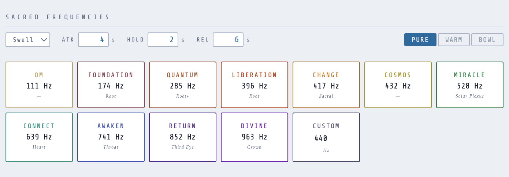
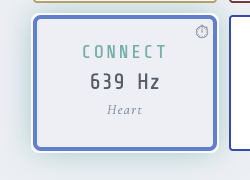

The claims around sacred frequencies are some of the murkiest in the entire wellness audio space. 528 Hz repairs DNA. 432 Hz is the "natural" frequency of the universe, suppressed in favor of 440 Hz by some combination of the Rockefellers and the Nazi propaganda ministry. 963 Hz activates the pineal gland. These specific assertions are not supported by evidence and in several cases are simply invented — the 528 Hz "DNA repair" claim traces to a single self-published book from the 1990s; the 432 Hz conspiracy has been debunked in detail by music historians. 

I include these frequencies in Sympatheia anyway, and I'll tell you why. The mythology doesn't determine usefulness — and that's true regardless of what level of reality you assign to the myth. If you take it literally, metaphorically, as cultural artifact, or as pure placebo surface, the conclusion is the same: what matters is whether working with a particular frequency does something for you. I'm skeptical of _some_ the specific claims, but I'm also skeptical of skepticism as a posture. Dismissing something because its stated mechanism is dubious or not explainable in a purely materialist paradigm is its own kind of laziness. These tones are interesting. Some of them genuinely sound different in ways that are hard to fully attribute to expectation. And the Pythagorean and just-intonation traditions underlying a few of them have real mathematical coherence that precedes all of the wellness marketing by centuries.[^4] I have no way to personally confirm Rockefeller level conspiracy or pineal gland repair.  I don't need to spend my time doing this, and this often degrades into belief traps on either side.  Tom Campbell's "Open Minded Skepticism" is all I think you really need to approach "Sacred Tones", especially with this free app that runs in a single isolated environment on your own device.

What I will do is tell you where these numbers came from, so you can decide what weight to put on them. 

---

## Where the solfeggio frequencies came from

The "original six" Solfeggio frequencies — 396, 417, 528, 639, 741, 852 Hz — were introduced by Dr. Joseph Puleo and Len Horowitz in their 1999 book *Healing Codes for the Biological Apocalypse*[^1]. Puleo claimed to have discovered them encoded in the Book of Numbers using a Pythagorean reduction method applied to verse numbering. The six frequencies were identified as the tones of an ancient Gregorian chant scale, claimed to have been suppressed by the Church.

The musicological evidence for this is nonexistent. The chant tradition has been extensively studied and no such scale appears in the historical record. The Pythagorean number reduction that generates the six values is a numerological technique, not a physical derivation. 

The set was later extended to nine (adding 174, 285, 963) by other practitioners. These extended frequencies are not from Puleo's original work.

Does this diminish their usefulness? The origins of specific frequencies are largely irrelevant — the answer depends more on your ontology than on the historical record. Does myth carry power? Joseph Campbell spent a career making that case. Perhaps the frequencies are nothing; perhaps they function as egregores, collective thought-forms that accrue reality through shared intention; perhaps they were genuinely suppressed and later rediscovered. The Church does have a documented track record of exactly this kind of erasure — the Albigensian Crusade against the Cathars being among its more thorough examples, and one that also gave rise to the Inquisition as a permanent institution.[^3] At the most basic level: if you assign a frequency to a purpose, and that sound then calls that purpose to mind, you've entered a reciprocal relationship with your intention, and aligned your will toward an outcome.

**432 Hz** has a separate and somewhat more interesting history. The argument is that A=432 Hz (rather than the modern standard A=440 Hz) is mathematically consonant with the natural world — with Pythagorean tuning, the Schumann resonance, the orbital periods of planets. This tradition has legitimate roots in 18th and 19th century pitch debates; Verdi famously advocated for A=432. The specific conspiracy version — Goebbels, a Berlin conference, psychological warfare — does appear to be unsupported at the primary source level, and probably traces to the LaRouche/Schiller Institute's anti-440 campaign in the 1980s rather than anything recoverable in the historical record.[^2] But "not provable from the official record" is a different thing from "false." The more interesting case for 432 Hz doesn't require a courtroom victory.

It's a pattern-based, power-aware, hermeneutic case. If you don't grant official institutions epistemic primacy, the surviving record favoring 440 doesn't settle much — it may only show which standard won bureaucratically. Standardization is not neutral: manufacturing ecosystems built around 440, conservatory training normalizing 440, broadcast and recording infrastructures reinforcing it, social prestige accruing to the standard pitch. These are recognizable mechanisms of soft displacement, not secret police confiscating tuning forks. Many things that later seemed natural were made to seem natural through exactly this kind of infrastructural coordination.

Then there's what counts as evidence. Many listeners, singers, sound healers, and experimental musicians report that 432 Hz feels more relaxed, grounded, physically coherent. A mainstream skeptic calls that expectation effect. In a non-materialist or plural-ontology framework, that dismissal isn't automatically superior — repeated subjective convergence across people with different priors and different bodies is a kind of evidence, especially in domains involving consciousness, embodiment, affect, and ritual. I can't confirm the suppression hypothesis. I can say the soft-displacement mechanism is real and recognizable, the subjective reports are worth taking seriously, and the aesthetic case for 432 stands on its own regardless of how the history resolves.

Whether 432 Hz sounds better than 440 Hz is a genuine aesthetic question. I think it sounds slightly warmer and more settled. Whether that's psychoacoustics, expectation, or something else, I can't say.

**111 Hz** and **Om** deserve a separate note. The 111 Hz association with "Om" comes from a different tradition — Drunvalo Melchizedek and the Sacred Geometry movement — and is distinct from the solfeggio system. The actual fundamental pitch of chanted "Om" varies widely by practitioner and tradition. 111 Hz is a low, resonant tone that many people find grounding. I find it useful. The attribution is folklore, and I love me some folklore.

---

## The frequency palette

Sympatheia includes eleven named tones plus a custom input.

| Hz | Name | Chakra | Traditional description |
|----|------|--------|------------------------|
| 111 | Om | — | Cellular regeneration |
| 174 | Foundation | Root | Pain relief, security |
| 285 | Quantum | Root+ | Tissue healing |
| 396 | Liberation | Root | Release fear & guilt |
| 417 | Change | Sacral | Transmute situations |
| 432 | Cosmos | — | Universal harmony |
| 528 | Miracle | Solar Plexus | DNA repair, Love |
| 639 | Connect | Heart | Relationships |
| 741 | Awaken | Throat | Intuition, expression |
| 852 | Return | Third Eye | Spiritual order |
| 963 | Divine | Crown | Unity consciousness |

The descriptions and chakra associations are included as cultural context, not clinical claims. Whether or not you hold them as meaningful, they give you an orienting intention for each tone — and intention is part of how meditative work functions.

The **Custom** tile accepts any frequency up to several kHz. If you want to work with a specific Hz value that isn't in the library — a binaural carrier you're already using, a note from a bowl you own, anything — enter it here.

---

## Tone character

Three character modes change the timbre of every tone.

**Pure** is two sine oscillators at the target frequency, detuned slightly (a few cents) and panned to opposite sides. The detuning creates a gentle natural width — not stereo chorus, just the barely perceptible shimmer of two slightly different sources. The result is essentially a single clean pitch. Good for carrier use alongside binaural beats, and for sessions where you want the frequency itself front and center without added timbre.

**Warm** adds two harmonic sine overtones on top of the pure pair: an octave (2× the fundamental, at 35% amplitude) and a perfect fifth (1.5×, at 25%). These are the first two harmonics you'd hear from a vibrating string or pipe. The tone gets a rounder, more vocal quality — still clearly a single pitch, but with presence. I use this more than Pure for tone work, since it fills out the sonic space without adding harmonic complexity that could interfere with the binaural carrier.

**Bowl** is a Tibetan singing bowl simulation. A singing bowl doesn't produce a single sine — it vibrates in multiple inharmonic modes simultaneously. The implementation models the first three vibrational modes: the fundamental, and two overtones at roughly 2.76× and 5.4× the base frequency (the Chladni [3,0] and [4,0] modes characteristic of cylindrical shells). Each mode has its own amplitude envelope with different hold and release times — the higher modes decay faster, just as they do on a physical bowl. And each mode uses two slightly-offset oscillators whose natural interference produces the characteristic slow beating pulse, without any LFO. Bowl character sounds physically real in a way the other modes don't. For tones below ~300 Hz it's particularly convincing. Try 174 Hz or 285 Hz in Bowl mode.

---

## ADSR shaping

Each tone has a full ADSR envelope: Attack, Decay, Sustain, Release, plus a Hold segment between Decay and Release.

Five presets:

**Swell** (default) — slow attack of 4 seconds, short decay, long hold and release. The tone fades in, sustains, and fades out gradually. This is what you want for most meditation use: the tone arrives without startling, holds through a contemplative pause, and recedes. The default ADSR is tuned so a fired tone occupies roughly 12–15 seconds of audible presence.

**Bell** — near-instant attack (10ms), fast decay, very short hold, moderate release. Sounds like a struck bell or chime. Attention-catching without being harsh. Good for marking transitions in a session — a gentle signal that something is shifting — rather than sustained tone work. Particularly effective in Bowl character.

**Pad** — even slower than Swell, with a longer hold and release. The tone takes about 6 seconds to fully arrive and lingers for nearly 20 seconds. Used for auto-play at longer intervals, this produces a slow wash of harmonic content beneath the background layers.

**Pluck** — an extremely fast attack (5ms) into a short decay that drops sustain to zero, with a brief tail. The tone essentially doesn't sustain at all — it's a transient, like a plucked string or a pizzicato note. Unusual in a meditation context but interesting for rhythm-aware use, or anywhere you want a percussive tonal event rather than a held note. Stacking several plucked tones in Bowl character produces something surprisingly like a struck bowl rather than a bowed one.

**Drone** — the opposite extreme. Very long attack (8 seconds), near-full sustain, and a 20-second hold before the release begins. A drone tone, once fired, occupies the space for close to 40 seconds of audible presence. At low volume this becomes a near-continuous undertone if auto-played at intervals shorter than the total duration — triggers overlap before the previous one has fully released, one fading as the next swells in. A continuous held note that breathes slightly with each cycle.

You can also adjust each parameter individually. The sliders are live — changing attack while a tone is playing takes effect on the next trigger.

---

## Triggering tones

**Manual** — clicking a tile fires the tone immediately. The tile lights briefly to confirm. You can fire the same tone repeatedly; the ADSR envelopes stack, so if you click 528 Hz three times in quick succession you'll get three overlapping swell tones — usually a pleasant wash rather than a problem.

**Auto-play** — each tile can be set to fire on a random interval. Set a minimum and maximum time in seconds; Sympatheia schedules the next trigger at a random point within that window, fires the tone, and immediately schedules the next one. The randomness matters — if the interval were fixed, the tone would arrive metronomically and the mind would start anticipating it, which is the opposite of what you want. Random-interval triggers land when they land and then dissolve back into the background.

Auto-play only fires during an active session (audio playing) and is suppressed during sequencer playback, where tone cues are scheduled deterministically. More on that in Part 4.

**Tone Reverb** — the option row checkbox from Part 1. Applies a convolution reverb to all tone output. The effect is subtle but noticeable: the tone seems to arrive from a larger, more resonant space. Worth enabling for Bowl mode especially, where the reverb tail adds physical plausibility to the room simulation. I leave it on for most sessions.

---

## How I actually use this

My typical tone setup is a small number of tones on auto-play at long intervals — 90 to 180 seconds minimum, 3 to 5 minutes maximum. Running in the background of a theta session, these arrive infrequently enough to be a pleasant surprise rather than a rhythmic event. The tone fires, holds through its swell, and fades before the next one arrives. Sometimes you're aware of it consciously; sometimes it just registers as a shift in the quality of the sound space.

For the carrier frequencies, I like tones under 256 Hz, and prefer 128 Hz.  I drift towards the power-of-two for no reason in particular. 

Bowl character at 285 Hz or 396 Hz is where I spend most of my time with this feature. The lower-register bowl tones have a physical weight to them that the pure and warm modes don't. Something about the inharmonic partials and the slow mode beating reads as more alive than a clean sine.  The bowl character was a more recent addition to Sympatheia, and I'm still finding interesting ways to work with it.

## What's next

Part 4 is the sequencer — programming a full session arc that moves through multiple states, with tone cues, ramps between beat frequencies, and the Chakra Bowl as a worked example of what a designed session looks like end-to-end.

[^1]: Horowitz, L., & Puleo, J. (1999). *Healing Codes for the Biological Apocalypse*. Tetrahedron Publishing Group.
[^2]: "432 Hz vs 440 Hz: An Analysis." https://www.perfect-fifth.co.uk/432hz.htm — musicological debunking of the Nazi/Rockefeller narrative around A=440; traces the conspiracy origin to the LaRouche/Schiller Institute campaign.
[^3]: Pegg, M.G. (2008). *A Most Holy War: The Albigensian Crusade and the Battle for Christendom*. Oxford University Press.
[^4]: Helmholtz, H. (1863). *On the Sensations of Tone as a Physiological Basis for the Theory of Music*. Translated by A.J. Ellis (1875). Dover Publications (reprint).
[^5]: "Parametric investigation of binaural beats and background noise." *Scientific Reports* (2025). https://www.nature.com/articles/s41598-025-88517-z
